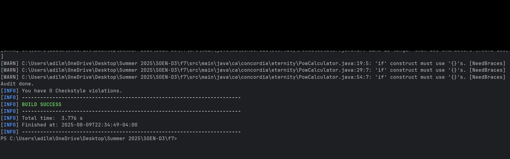
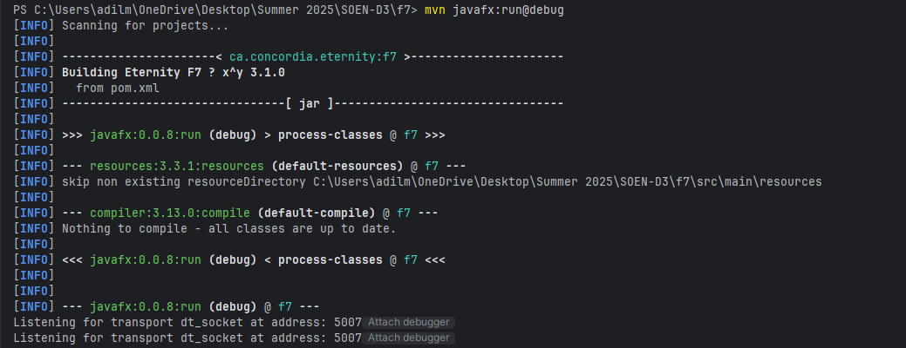
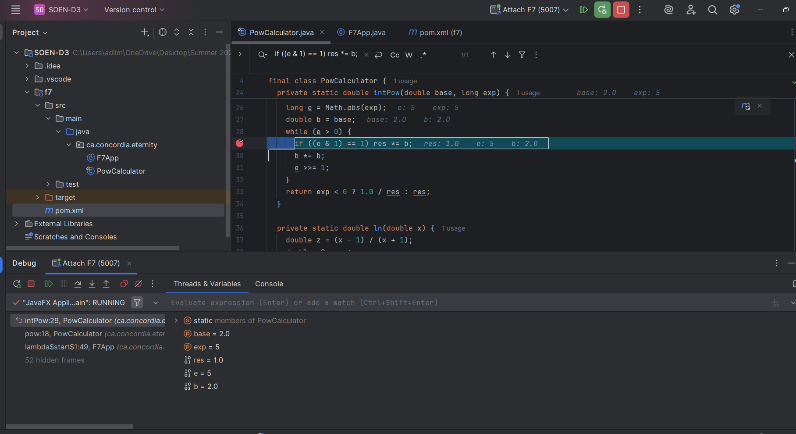
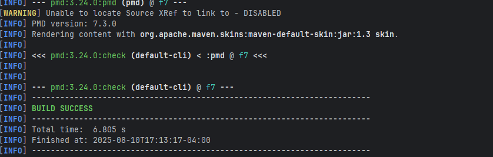
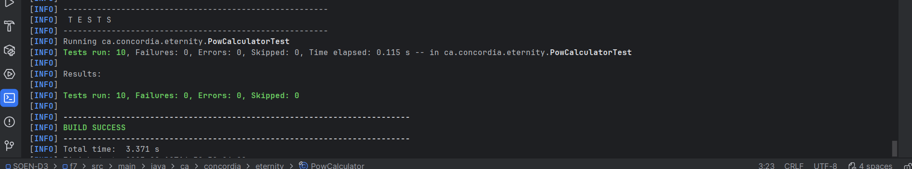

# Eternity F7 – x^y Function Calculator

## Author 

Adilmanzoor Kalilur Rahman - Electrical and Computer Engineering, Concordia University.


## 📌 Overview
This project implements the **x^y** mathematical function from scratch in Java, as part of **SOEN 6011 – Deliverable 3**.  
The implementation uses:
- **Exponentiation by squaring** for integer exponents.
- **Series expansion** (Gregory series for ln(x), Maclaurin series for exp(t)) for real exponents.
- **Strict domain and range checks** for input validation.
- **JavaFX GUI** for user interaction.
- **Accessibility and UI design principles** to ensure usability.

---

## ✨ Features
- Accurate computation for |x|, |y| ≤ 10⁶ with precision ≤ **1×10⁻¹²**.
- Handles all special cases:
    - `0^0` → domain error
    - Negative base with fractional exponent → domain error
    - NaN inputs → numeric error
    - Large magnitude inputs → range error
- GUI designed for clarity, usability, and accessibility.
- Conforms to **Google Java Style Guide** (via Checkstyle).
- Static code analysis using **PMD** and **SpotBugs**.
- Debugging using **JDB** and IntelliJ breakpoints.
- Automated testing with **JUnit**.

---
## 📜 Version History (Semantic Versioning)

- **3.1.0** – Added accessibility improvements, debugger integration, and static analysis compliance.
- **3.0.0** – Implemented GUI in JavaFX.
- **2.0.0** – Added real exponent handling via series expansion.
- **1.0.0** – Initial integer exponentiation implementation.
---
## 🛠 Technologies & Tools

- **Java 21** – Programming language
- **JavaFX** – GUI framework
- **Maven** – Build & dependency management
- **JUnit 4** – Unit testing
- **Checkstyle** – Code style compliance
- **PMD** – Static code analysis
- **SpotBugs** – Bug detection
- **JDB** – Java Debugger
- **IntelliJ IDEA** – Development and remote debugging

---

## 📦 Dependencies
These are automatically handled via Maven in `pom.xml`:
```xml
<dependencies>
    <!-- JavaFX -->
    <dependency>
        <groupId>org.openjfx</groupId>
        <artifactId>javafx-controls</artifactId>
        <version>21</version>
    </dependency>

    <!-- JUnit for testing -->
    <dependency>
        <groupId>junit</groupId>
        <artifactId>junit</artifactId>
        <version>4.13.2</version>
        <scope>test</scope>
    </dependency>

    <!-- Checkstyle Plugin -->
    <dependency>
        <groupId>com.puppycrawl.tools</groupId>
        <artifactId>checkstyle</artifactId>
        <version>10.12.3</version>
    </dependency>
</dependencies>

```
---

## 🚀 How to Run

### 1️⃣ Clone the repository
```bash
git clone <your-repo-link>
cd f7
```

### 2️⃣ Run the application normally
```bash
mvn javafx:run
```

### 3️⃣ Run in debug mode
```bash
mvn javafx:run@debug
```
Attach the debugger in IntelliJ (**Run → Edit Configurations → Remote JVM Debug**).  
Default host: `localhost`, port: `5005`.

---

## 🐞 Debugging
To debug using **JDB**:
```bash
jdb -attach 5005
```
**Set breakpoints in:**
- `pow()` – to catch all domain and series logic
- `intPow()` – to debug integer exponent path
- `ln()` and `exp()` – to debug series calculations

---

## ✅ Running Tests
```bash
mvn test
```
JUnit tests cover:
- Positive integer exponent
- Negative integer exponent
- Positive real exponent
- Zero base and exponent edge cases
- Invalid domain and range inputs

---

## 📏 Code Quality & Static Analysis

**Checkstyle**
```bash
mvn --% checkstyle:check "-Dmaven.test.skip=true"

```

**PMD**
```bash
mvn pmd:check
```

**SpotBugs**
```bash
mvn com.github.spotbugs:spotbugs-maven-plugin:check
```

---

## 🖥 GUI Accessibility
The JavaFX UI:
- Uses **clear labels and controls**
- Provides **keyboard navigation**
- Uses **accessible colors and fonts** for readability
- Compatible with **Java Accessibility API**

---


---

## 📂 Project Structure
```
f7/
│── pom.xml
│── README.md
└── src/
    ├── main/java/ca/concordia/eternity/
    │   ├── PowCalculator.java
    │   ├── MainApp.java
    │   └── ...
    ├── test/java/ca/concordia/eternity/
    │   └── PowCalculatorTest.java
```

---

## Screenshots 


#### 1. **Checkstyle Analysis**


_Checkstyle command execution showing style 0 violations in PowCalculator.java_

#### 2. **SpotBugs Static Analysis**
SpotBugs was executed to analyze the compiled Java bytecode for potential bugs and code quality issues. The analysis completed successfully with no critical issues detected, as shown in the screenshot above.

#### 3. **JDB Debugging**



Application started in debug mode, breakpoint set at line 29 in intPow method, execution paused with inspected variables showing base = 2.0, exp = 5, and res = 1.0 to verify integer exponentiation flow.
#### 4. **Code Quality & Static Analysis:**
PMD was used as the static code analysis tool to detect potential bugs, code smells, and maintainability issues. The analysis reported zero violations, confirming adherence to coding standards and best practices.


_PMD command execution showing successful analysis with no violations found_


_PMD HTML report showing "PMD found no problems in your source code"_

#### 5. **JUnit testcase:**
JUnit tests were executed successfully, covering integer exponents, real exponents, edge cases, and invalid inputs. All 10 tests passed with zero failures or errors, confirming the correctness of the implementation.



## Licence 

For academic purposes only – Concordia University, SOEN 6011, Deliverable 3.


## 📚 References

###  PMD Static Code Analysis
- [PMD Official Website](https://pmd.github.io/) – Documentation, rulesets, and usage instructions.
- [Maven PMD Plugin](https://maven.apache.org/plugins/maven-pmd-plugin/) – Guide for integrating PMD into Maven projects.
- [PMD GitHub Repository](https://github.com/pmd/pmd) – Source code and contribution guidelines.

### JUnit Testing
- [JUnit 5 Official User Guide](https://junit.org/junit5/docs/current/user-guide/) – Comprehensive guide to writing and running tests.
- [JUnit GitHub Repository](https://github.com/junit-team/junit5) – Source code and examples.

###  Checkstyle Code Style Verification
- [Checkstyle Official Website](https://checkstyle.sourceforge.io/) – Documentation, style checks, and configuration examples.
- [Maven Checkstyle Plugin](https://maven.apache.org/plugins/maven-checkstyle-plugin/) – Guide for integrating Checkstyle into Maven builds.

### SpotBugs Static Analysis
- [SpotBugs Official Website](https://spotbugs.github.io/) – Documentation, usage guides, and plugin details.
- [Maven SpotBugs Plugin](https://spotbugs.github.io/spotbugs-maven-plugin/) – Official guide for integrating SpotBugs with Maven builds.
- [SpotBugs GitHub Repository](https://github.com/spotbugs/spotbugs) – Source code and contribution guidelines.

